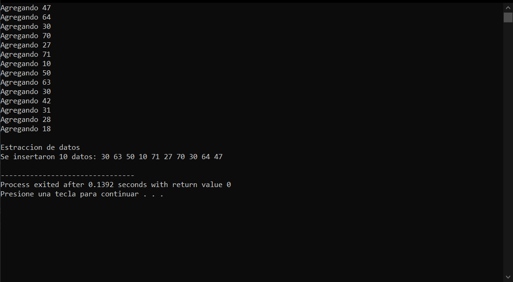

# CPP Stack
Una pila (stack) es una estructura que permite almacenar datos de manera que los primeros datos que entran son los primeros en salir.

Este proyecto esta dedicado a implementar la estructura de una pila en el lenguage C/C++.

</img>